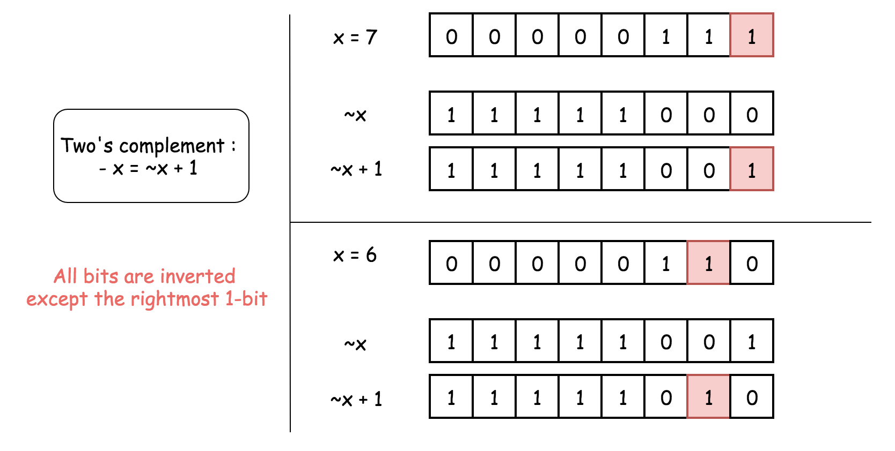
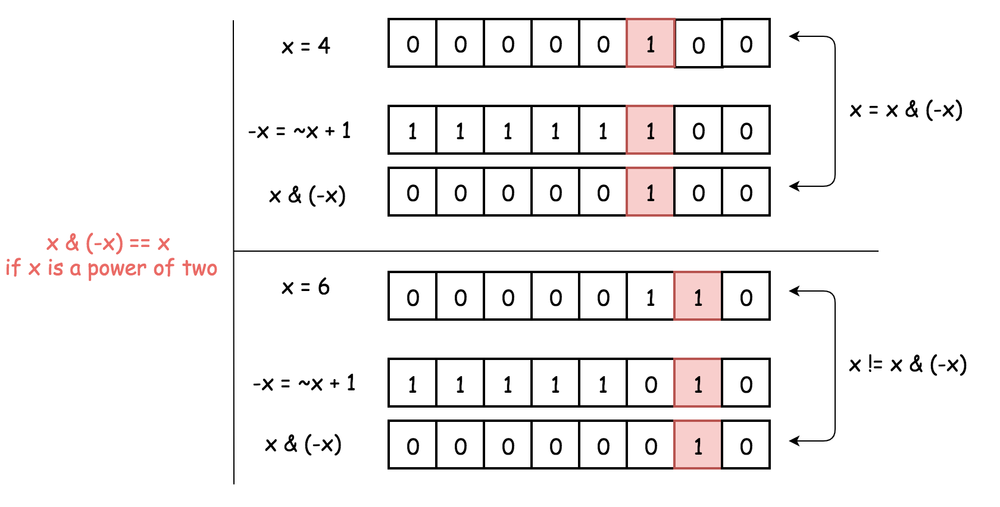

#Oh_MyBug刷题冷知识

## 关于位运算

### 位运算冷知识1
> 可以用`异或^`来判断**两数相除**后是否为负，代码简洁很多，如果单纯用`且&&`和`或||`表示，判断语句较冗长。

解释：用真值表可以表示为：

num1 > 0 ^ num2 > 0(其中 num1 为被除数，num2 为除数)

|num1 > 0|num2 > 0|result|
|---     |---     |---   |
|   1    |   1    |  0   | 
|   1    |   0    |  1   |
|   0    |   1    |  1   |
|   0    |   0    |  0   |

result = 0 代表结果为正， result = 1 代表结果为负。
```
public String fractionToDecimal(int numerator, int denominator) {
    // ...
    // If either one is negative (not both)
       if (numerator < 0 ^ denominator < 0) {
           fraction.append("-");
       }
    // ...
}
```
来源：[166. 分数到小数(官方题解)](https://leetcode-cn.com/problems/fraction-to-recurring-decimal/solution/fen-shu-dao-xiao-shu-by-leetcode/(https://leetcode-cn.com/problems/divide-two-integers/))

### 位运算冷知识2
异或运算有以下三个性质：
  - 任何数和 0 做异或运算，结果仍然是原来的数，即 a $\bigoplus 0=a \bigoplus 0=a$
  - 任何数和其自身做异或运算，结果是 0，即 $a \bigoplus a=0$
  - 异或运算满足交换律和结合律，即  $a\bigoplus b \bigoplus a=b \bigoplus a \bigoplus a=b \bigoplus (a \bigoplus a)=b \bigoplus 0=b$
  
来源：[136. 只出现一次的数字(官方题解)](https://leetcode-cn.com/problems/single-number/solution/zhi-chu-xian-yi-ci-de-shu-zi-by-leetcode-solution/)

### 位运算冷知识3
>x & (-x) 可以获取到二进制中最右边的 1，且其它位设置为 0。

在补码表示法中，$-x = \lnot x + 1$。换句话说，要计算 −x，则要将 x 所有位取反再加 1。

在二进制表示中，$\lnot x + 1$ 表示将该 1 移动到 $\lnot x$ 中最右边的 0 的位置上，并将所有较低位的位设置为 0。而 $\lnot x$ 最右边的 0 的位置对应于 x 最右边的 1 的位置。

总而言之，$-x = \lnot x + 1$，此操作将 x 所有位取反，但是最右边的 1 除外。

<div>
    
</div>

因此，x 和 -x 只有一个共同点：最右边的 1。这说明 x & (-x) 将保留最右边的 1。并将其他的位设置为 0。

<div>
    
</div>

应用：[检查是否为2的幂](https://leetcode-cn.com/problems/power-of-two/solution/2de-mi-by-leetcode/)

我们通过 x & (-x) 保留了最右边的 1，并将其他位设置为 0 若 x 为 2 的幂，则它的二进制表示中只包含一个 1，则有 x & (-x) = x。

若 x 不是 2 的幂，则在二进制表示中存在其他 1，因此 x & (-x) != x。

因此判断是否为 2 的幂的关键是：判断 x & (-x) == x。

<div>
    
</div>

```
public boolean isPowerOfTwo(int n) {
    if (n <= 0) return false;
    return (n & (-n)) == n;
}
```

### 位运算冷知识4

> x & (x - 1) 可以将最右边的 1 设置为 0。

(x - 1) 代表了将 x 最右边的 1 设置为 0，并且将较低位设置为 1。

再使用与运算：则 x 最右边的 1 和就会被设置为 0，因为 1 & 0 = 0。

<div>
    
</div>

应用：[检查是否为2的幂](https://leetcode-cn.com/problems/power-of-two/solution/2de-mi-by-leetcode/)

1. 2 的幂二进制表示只含有一个 1。
2. x & (x - 1) 操作会将 2 的幂设置为 0，因此判断是否为 2 的幂是：判断 x & (x - 1) == 0。

<div>
    
</div>

```
public boolean isPowerOfTwo(int n) {
    if (n <= 0) return false;
    return (n & (n - 1)) == 0;
}
```

