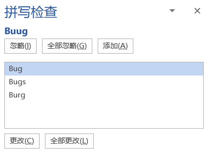
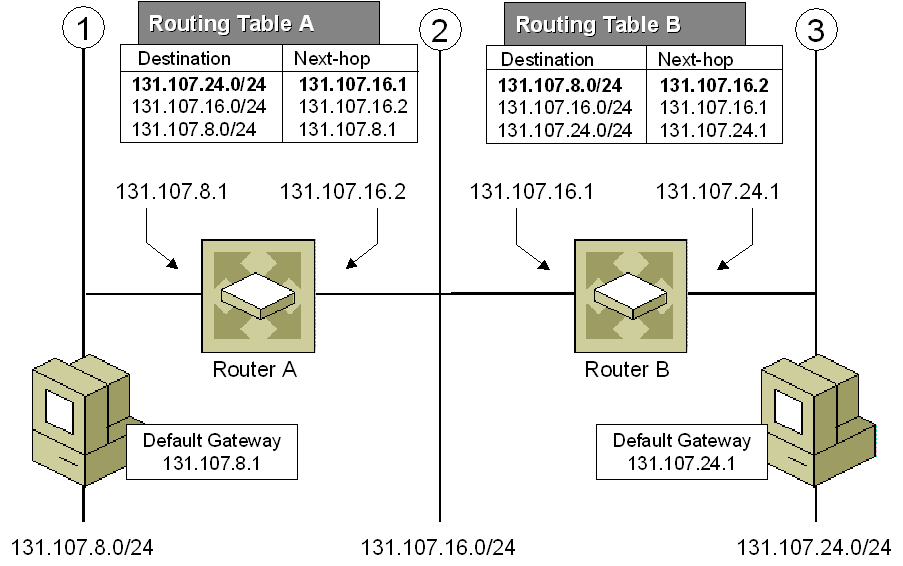
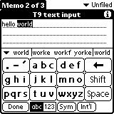
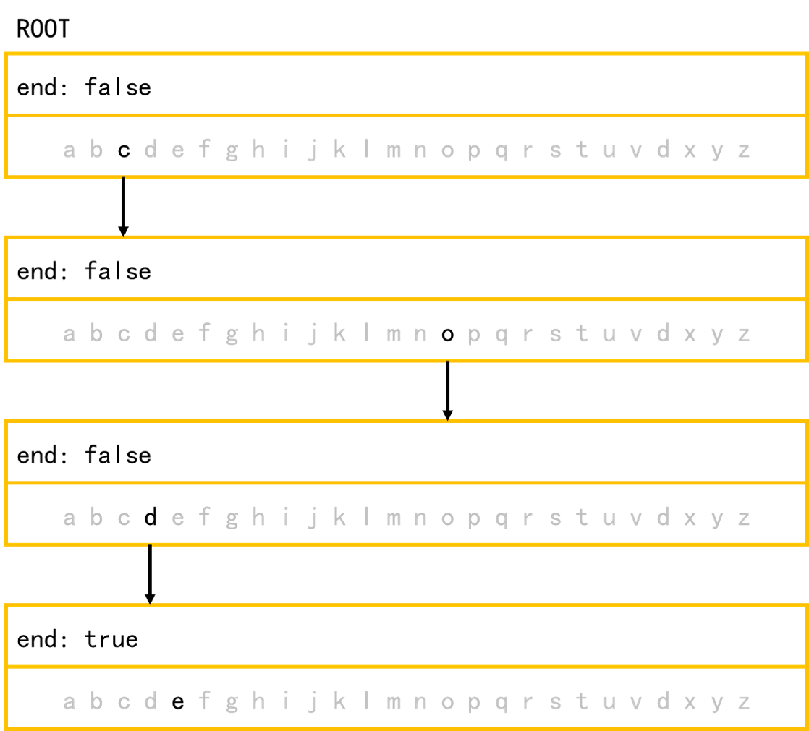
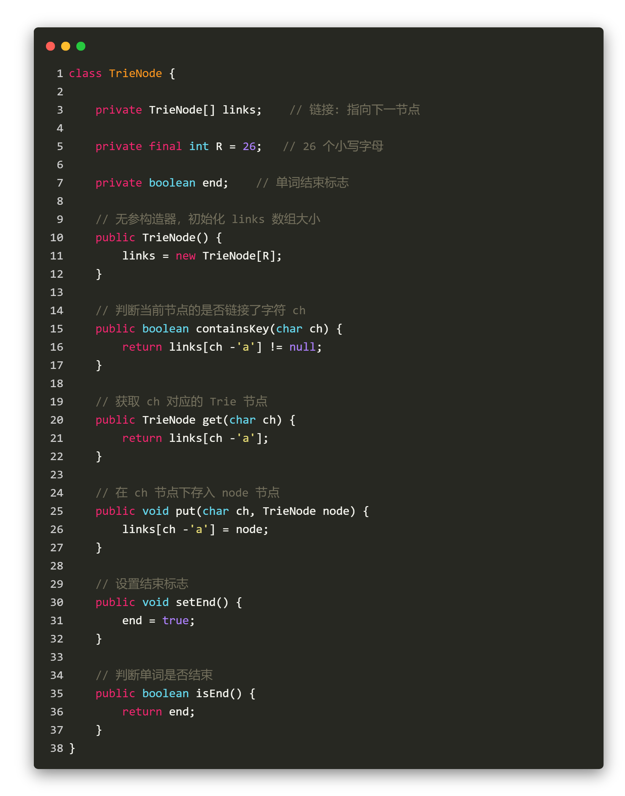
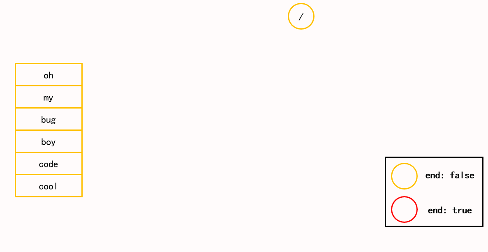
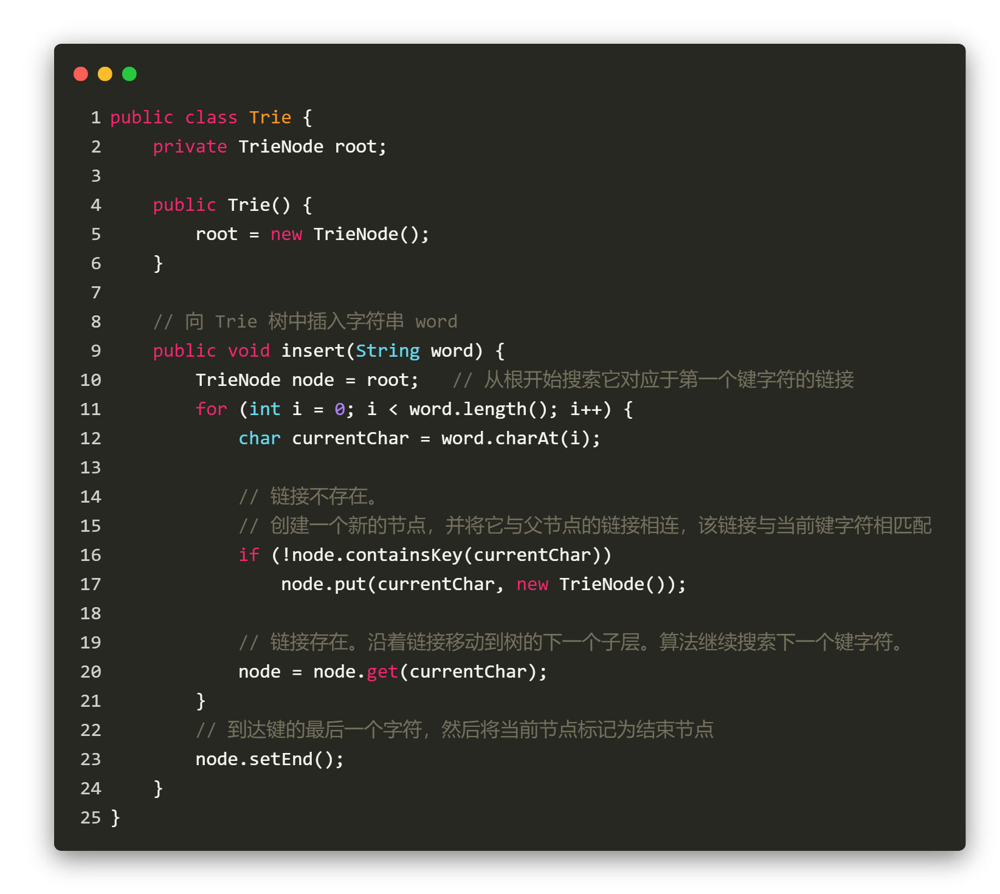
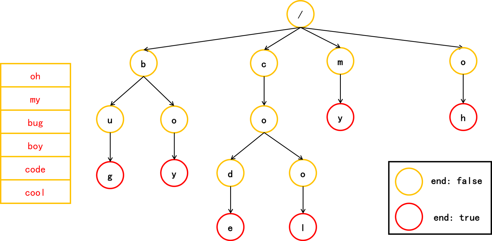
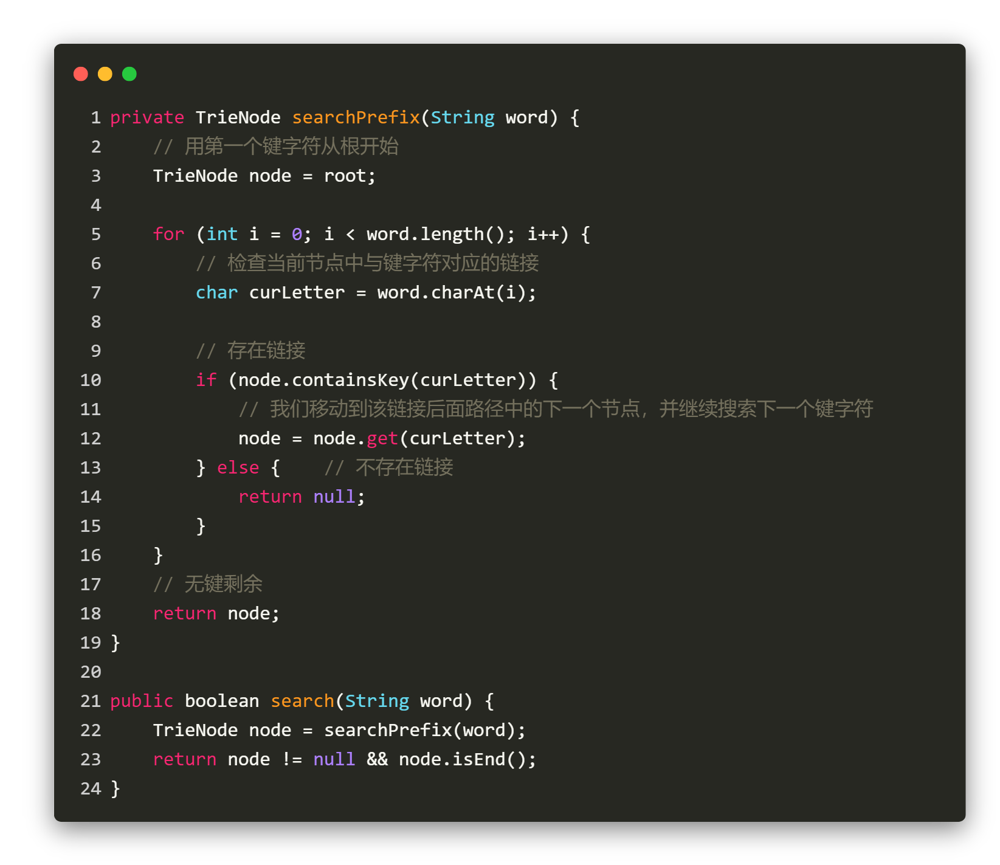
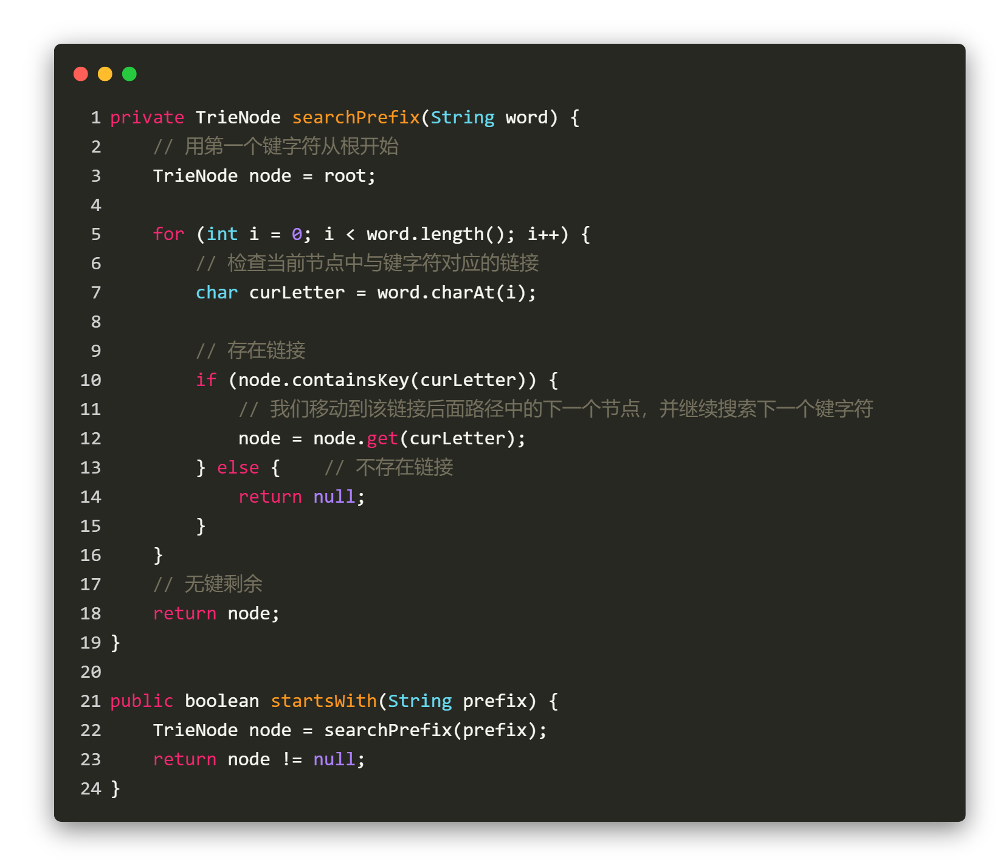

#Trie 树

### 定义

在计算机科学中，trie，又称前缀树或字典树，是一种有序树，用于保存关联数组，其中的键通常是字符串。

### 应用

1. 自动补全（前缀匹配）

例如：找出一个字符串集合中所有以`一起爬`开头的字符串。我们只需要用所有字符串构造一个Trie树，然后输出以 `一−>起−>爬` 开头的路径上的关键字即可。

Trie树前缀匹配常用于搜索提示。如当输入一个网址，可以自动搜索出可能的选择。当没有完全匹配的搜索结果，可以返回前缀最相似的可能。

    

2. 拼写检查

文字处理软件（比如 `Word`）中会有拼写检查这一功能，程序会自动检查用户在文档中拼写的单词是否在系统字典中存在，如果没有在字典中找到对应的单词，系统会提示拼写错误（红色波浪线），并根据拼错的单词给出相应的建议。

    

3. IP 路由 (最长前缀匹配)

使用Trie树的最长前缀匹配算法，Internet 协议（IP）路由中利用转发表选择路径。

    

4. T9 (九宫格) 打字预测

T9（九宫格输入），在 20 世纪 90 年代常用于手机输入

    

### Trie 树特点

- 根节点不包含字符，除根节点以外每个节点只包含一个字符。
- 从根节点到某一个节点，路径上经过的字符连接起来，为该节点对应的字符串。
- 每个节点的所有子节点包含的字符串不相同。

### Trie 树节点的数据结构

Trie 树是一个有根的树，其结点具有以下字段：

最多 R 个指向子结点的链接，其中每个链接对应字母表数据集中的一个字母。
- 本文中假定 R 为 26，小写拉丁字母的数量。
- 布尔字段，以指定节点是`对应键(单词)的结尾`还是只是`键前缀`。

    

以下是 Trie 树节点的数据结构代码：

    

s

### 向 Trie 树中插入键

我们通过搜索 Trie 树来插入一个键。我们从根开始搜索它对应于第一个键字符的链接。有两种情况：

- 链接存在。沿着链接移动到树的下一个子层。算法继续搜索下一个键字符。
- 链接不存在。创建一个新的节点，并将它与父节点的链接相连，该链接与当前的键字符相匹配。

重复以上步骤，直到到达键的最后一个字符，然后将当前节点标记为结束节点，算法完成。

以下是向 Trie 树中插入键的核心代码:

    

**复杂度分析**

- 时间复杂度：**O(m)**，其中 m 为`键长`。在算法的每次迭代中，我们要么检查要么创建一个节点，直到到达键尾。只需要 m 次操作。

- 空间复杂度：**O(m)**。最坏的情况下，新插入的键和 Trie 树中已有的键没有公共前缀。此时需要添加 m 个结点，使用 **O(m)** 空间。

### 在 Trie 树中查找键

每个键在 trie 中表示为从根到内部节点或叶的路径。我们用第一个键字符从根开始，检查当前节点中与键字符对应的链接。有两种情况：

- 存在链接。我们移动到该链接后面路径中的下一个节点，并继续搜索下一个键字符。
- 不存在链接。若已无键字符，且当前结点标记为 isEnd，则返回 true。否则有两种可能，均返回 false :
    - 还有键字符剩余，但无法跟随 Trie 树的键路径，找不到键。
    - 没有键字符剩余，但当前结点没有标记为 isEnd。也就是说，待查找键只是Trie树中另一个键的前缀。

    

**举个栗子**：

在Trie树中查找一个字符串的时候，比如查找字符串code，可以将要查找的字符串分割成单个的字符c，o，d，e，然后从Trie树的根节点开始匹配。

- 当匹配 c->o>d->e 时一直存在链接，则移动到该链接后面路径中的下一个节点，并继续搜索下一个键字符。
- 当到达 e 键字符时，不存在链接，字符串 code 也已经没有键字符，且当前结点标记为 isEnd，**返回 true**。

在Trie树中查找一个字符串的时候，比如查找字符串 cod （鳕鱼），可以将要查找的字符串分割成单个的字符c，o，d，然后从Trie树的根节点开始匹配。

- 当到达 d 键字符时，字符串 cod 已经没有键字符，但当前结点没有标记为 isEnd。也就是说，待查找键只是Trie树中另一个键的前缀，**返回 false**。

在Trie树中查找一个字符串的时候，比如查找字符串 bugs（虫子），可以将要查找的字符串分割成单个的字符b，u，g，s，然后从Trie树的根节点开始匹配。

- 当到达 g 键字符时，字符串 bugs 还有键字符剩余，但无法跟随 Trie 树的键路径，找不到键，**返回 false**。

以下是在 Trie 树中查找键的核心代码:

    

**复杂度分析**

- 时间复杂度 : **O(m)**。算法的每一步均搜索下一个键字符。最坏的情况下需要 m 次操作。
- 空间复杂度 : **O(1)**。

### 查找 Trie 树中的键前缀

该方法与在 Trie 树中搜索键时使用的方法非常相似。我们从根遍历 Trie 树，直到键前缀中没有字符，或者无法用当前的键字符继续 Trie 中的路径。

与上面提到的“搜索键”算法唯一的区别是：到达键前缀的末尾时，总是返回 true。我们不需要考虑当前 Trie 节点是否用 `end` 标记，因为我们搜索的是键的前缀，而不是整个键。

    

**复杂度分析**
- 时间复杂度 : **O(m)**。
- 空间复杂度 : **O(1)**。

### Trie 树核心思想

通过最大限度地减少无谓的字符串比较，使得查询高效率，即「用空间换时间」，再利用共同前缀来提高查询效率。

### Trie 树与其他数据结构比较

还有其他的数据结构，如平衡树和哈希表，使我们能够在字符串数据集中搜索单词。为什么我们还需要 Trie 树呢？

1. 二叉搜索树（binary search tree, BST）

二叉搜索树又叫做二叉排序树，它满足：

- 任意节点如果左子树不为空，左子树所有节点的值都小于根节点的值；
- 任意节点如果右子树不为空，右子树所有节点的值都大于根节点的值；
- 左右子树也都是二叉搜索树；
- 所有节点的值都不相同。

其实二叉搜索树的优势已经在与查找、插入的时间复杂度上了，通常只有 **O(log n)**，很多集合都是通过它来实现的。在进行插入的时候，实质上是给树添加新的叶子节点，避免了节点移动，搜索、插入和删除的复杂度等于树的高度，属于 **O(log n)**，最坏情况下整棵树所有的节点都只有一个子节点，完全变成一个线性表，复杂度是 **O(n)**。

Trie 树在最坏情况下查找要快过二叉搜索树，如果`搜索字符串长度`用 m 来表示的话，它只有 **O(m)**，通常情况（`树的节点个数` n 要远大于搜索字符串的长度）下要远小于 **O(n)**。

2. 哈希表(Hash Table)

尽管哈希表可以在 **O(1)** 时间内寻找键值，却无法高效的完成以下操作：

- 找到具有同一前缀的全部键值。
- 按词典序枚举字符串的数据集。

Trie 树优于哈希表的另一个理由是，随着哈希表大小增加，会出现大量的冲突，时间复杂度可能增加到 **O(n)**，其中 n 是`插入的键的数量`（可以认为是总单词数）。与哈希表相比，Trie 树在存储多个具有相同前缀的键时可以使用较少的空间。此时 Trie 树只需要 **O(m)** 的时间复杂度，其中 m 为`键长`（可以认为是一个单词的长度）。而在平衡树中查找键值需要 **O(m log n)** 时间复杂度。

### 参考

[《Trie 树和其它数据结构的比较》](https://www.raychase.net/1783)
[LeetCode官方题解](https://leetcode-cn.com/problems/implement-trie-prefix-tree/solution/shi-xian-trie-qian-zhui-shu-by-leetcode/)
